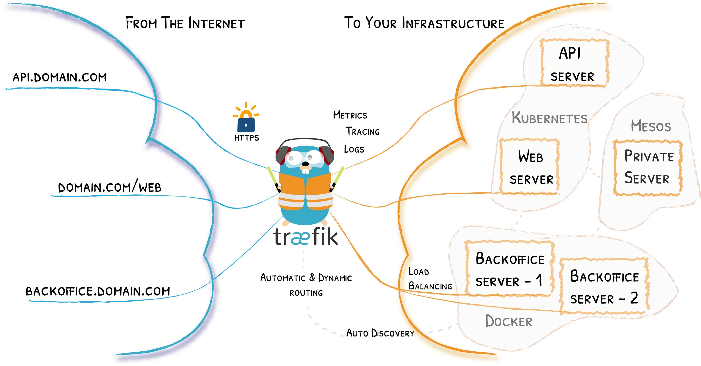
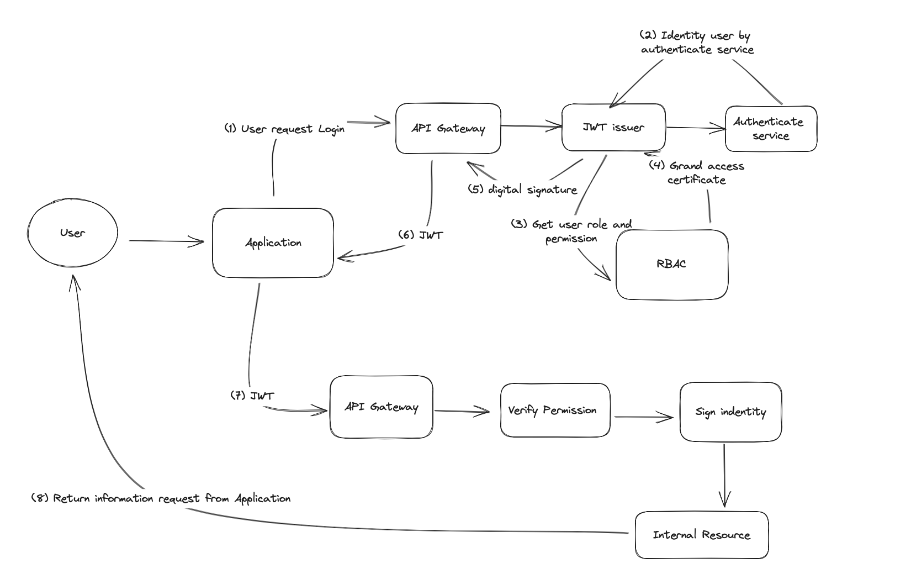
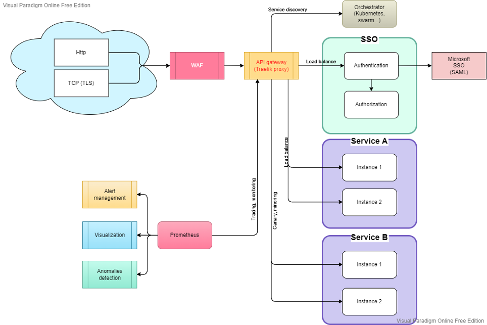
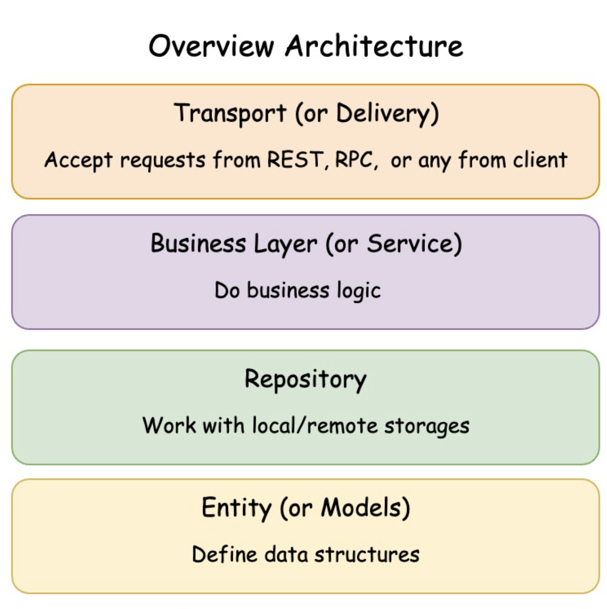

# SSO services with Traefik integration

## What is this project doing ?
* This project demonstrates how to integrate with Treaefik integration for authentication and authorization
* Demonstrates domain driven architecture
* Solution for manage user permissions
* Showcases for writing unit tests
## How to use and deploy this project (Docker environment)?
* To setup and customer SSO service: Please view file `Dockerfile` and customizer code on path `/server`
* To migration core db. Please see file `migration_{time_update}.sql` at path `server`
* To customize `Treafik GateWay` please access folder `traefik.yml`
* Folder `service` contents source code of dummy service for test and build by `idt.Dokerfile`
* To see how all component setup and deploy please access `docker-compose.yml`

********************************
## Overview about how this service work

### Overview
First of all, what is Treaefik proxy - Traefik is based on the concept of EntryPoints, Routers, Middlewares and Services. The main features include dynamic configuration, automatic service discovery, and support for multiple backends and protocols.
Traefik overview (source get from: https://doc.traefik.io/traefik/)
### Workflow diagram
* User need authn and then authorize to be identity and get list permission before access internal resource.
* When user request to access internal resource. They must provide JWT to identity. After success validation JWT in SSO service. Gateway will transfer request to internal resource to verify and claim resource. Finally, gateway will return result to User through Application
Overview workflow

System Architect

*********************************
## Main Architect of this project
This project apply Domain Driven with 4 layers

### Some principles rules should apply to avoid source becoming messed up:
* In same layers it should not call each other. You should consume resources from higher layer then give this resource for your source code
* Communicate by interface. It provides ability to flexibly replace and extend functionality. By interface, you can have overviewed of function and can apply unit tests
* Should hav isolation function in repository layer. One feature should not know what other do. They have to communicate through interface

*********************************
## How I write unit test
* All unittests should write at Business Layer (or Service). Ex: `server/service/go-kontrol`
* We should not unit test library, db layer, transport layer. Because these layers should be stable, with library there scope is too big, and it is always tested in process develop
* Use mock to cover response for 3rd services and storage layers.
* Use mockgen for saving effort gen mock. 
  * Download lib ` go install github.com/golang/mock/mockgen@v1.6.0`
  * Generate mock example `mockgen -source=contract.go -destination=source.go`
  * For detail example please access unit test example: `server/service/go-kontrol/kontrol_test.go`